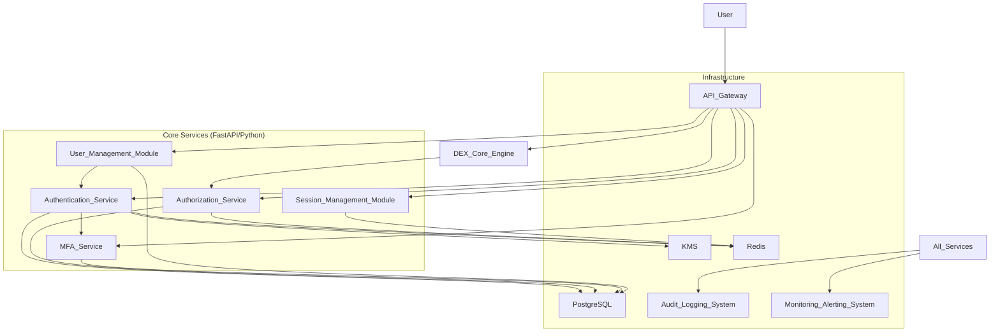

# Master Project Plan: DEX-Core-Engine Security & Compliance Hardening Initiative

**Document Version:** 1.0
**Last Updated:** 2025-06-15
**Prepared For:** AI Agent Swarm & Project Stakeholders
**Human Contact:** Security Architecture Lead, security@dex-core-engine.com

## **1. Introduction & Vision**

### **1.1. Project Overview**

The DEX-Core-Engine Security & Compliance Hardening Initiative aims to transform the existing DEX trading bot codebase into a production-ready, institutionally-compliant financial trading platform by addressing critical security vulnerabilities, implementing comprehensive regulatory compliance frameworks, and establishing enterprise-grade operational resilience capabilities.

### **1.2. Problem Statement / Opportunity**

The current DEX-Core-Engine implementation contains critical financial logic vulnerabilities, insufficient regulatory compliance mechanisms, and security gaps that prevent institutional adoption and expose users to significant financial and regulatory risks. This creates an urgent need for comprehensive security hardening and compliance integration to unlock institutional markets and ensure user trust.

### **1.3. Core Vision**

To establish DEX-Core-Engine as the industry-leading secure and compliant DeFi trading platform that meets institutional security standards while maintaining competitive performance and user experience. This initiative will build a foundation of trust and reliability, making DEX-Core-Engine the preferred platform for sophisticated financial entities.

## **2. Project Goals & Objectives**

### **2.1. Strategic Goals**

*   **Goal 1:** Achieve an institutional-grade security posture meeting stringent standards such as SOX, SOC 2, and ISO 27001. This involves a fundamental uplift in security practices, technology, and processes.
*   **Goal 2:** Implement a comprehensive regulatory compliance framework that supports global operations, addressing requirements like AML/KYC, transaction reporting, and data privacy.
*   **Goal 3:** Establish market-leading operational resilience with a target of 99.99% uptime Service Level Agreement (SLA) capability, ensuring continuous and reliable service for all users.

### **2.2. Specific Objectives (V1 / Initial Release)**

*   **Objective 1.1:** Eliminate all P0 (Critical) and P1 (High) security vulnerabilities identified in the recent security audit within the next 6 months through targeted remediation and architectural improvements.
*   **Objective 1.2:** Implement a core Anti-Money Laundering (AML) and Know Your Customer (KYC) compliance framework, including automated transaction monitoring for suspicious activities, within the next 4 months.
*   **Objective 1.3:** Deploy a production-ready, security-hardened infrastructure platform with comprehensive monitoring, real-time alerting, and robust disaster recovery capabilities within the next 5 months.

## **3. Scope**

### **3.1. In Scope (Key Deliverables & Functionalities for V1)**

The initial version (V1) of this initiative will focus on delivering the following core functionalities and enhancements:

*   **Complete Financial Logic Security Hardening:** This includes rigorous decimal precision fixes across all calculations and the implementation of sophisticated MEV (Maximal Extractable Value) protection mechanisms.
*   **Production-Grade Private Key Management System:** Deployment of a system utilizing Hardware Security Modules (HSM) for secure key storage and operations, along with secure memory handling and multi-signature support.
*   **Comprehensive Regulatory Compliance Framework:** Implementation of systems for AML/KYC, automated transaction monitoring, sanctions screening, and generation of auditable trails and reports for regulatory bodies.
*   **Security-Hardened Infrastructure Deployment:** Establishment of a secure container orchestration platform (Kubernetes) with robust container security, network policies, and continuous security monitoring.
*   **Enhanced Authentication & Authorization System:** Development of a financial-grade system featuring FAPI-compliant OAuth 2.0, hardware token-based multi-factor authentication (MFA), and granular Role-Based Access Control (RBAC).
*   **Operational Resilience Implementation:** Design and implementation of disaster recovery plans and business continuity strategies to meet uptime and data integrity requirements.
*   **Complete Test Suite Overhaul:** Expansion and enhancement of the existing test suite to include comprehensive security testing, integration testing for new services, and compliance verification tests.

### **3.2. Out of Scope (For V1)**

The following items are considered out of scope for the V1 release to maintain focus and ensure timely delivery of core security and compliance objectives:

*   Advanced AI/ML-based trading strategies and market prediction capabilities.
*   Full geographic expansion beyond the initial target markets of the US and EU.
*   Advanced social trading features, such as portfolio sharing and copy trading.
*   Development of native mobile applications for iOS or Android.
*   Direct integration with traditional banking systems beyond what is required for regulatory reporting.

## **4. Target Users & Audience**

### **4.1. Primary User Persona 1: Institutional Trading Operations Manager**

*   **Needs:** Assurance of regulatory compliance, comprehensive and immutable audit trails for all transactions and operations, robust enterprise-grade security controls to protect assets and data.
*   **Pain Points:** Current lack of institutional-grade security features, insufficient and manual compliance reporting processes, significant operational risk exposure due to platform vulnerabilities.

### **4.2. Primary User Persona 2: Compliance and Risk Management Officer**

*   **Needs:** Real-time transaction monitoring capabilities, automated compliance reporting for various regulatory bodies, comprehensive risk controls and mitigation strategies.
*   **Pain Points:** Predominantly manual compliance processes leading to inefficiencies and potential errors, inadequate audit trails for investigations, uncertainty regarding adherence to evolving regulatory landscapes.

## **5. Core Features & High-Level Requirements (V1)**

This section details the core features to be developed and implemented as part of the V1 release. Each feature description is followed by its high-level requirements, architectural overview, and other relevant specifications.

---

### **5.1. Feature: Financial Logic Security Hardening**

*   **Description:** This feature involves a complete overhaul of the DEX-Core-Engine's financial calculation logic. The primary goals are to eliminate decimal precision errors that can lead to incorrect accounting or fund discrepancies, and to implement comprehensive arbitrage validation with robust MEV (Maximal Extractable Value) protection to safeguard user transactions from common on-chain exploitation tactics.
*   **Priority:** Must-Have

#### **Key Requirements/User Stories:**

*   Implement token-agnostic decimal handling supporting all common ERC-20 token standards (e.g., 6, 8, 18 decimals) to ensure accuracy in all financial calculations.
*   Deploy comprehensive MEV protection, including integration with private mempool services (e.g., Flashbots Protect) and mechanisms to prevent sandwich attacks.
*   Add real-time price impact validation with configurable circuit breakers for high-impact trades to protect users from excessive slippage and market manipulation.

#### **Acceptance Criteria:**

*   **Decimal Handling:**
    *   The system shall accurately perform all financial calculations (e.g., trade size, value, profit/loss, fees) for ERC-20 tokens with 6, 8, and 18 decimal places.
    *   No precision errors shall be observed in any simulated or live financial calculations involving tokens with varying decimal configurations.
    *   The system shall correctly convert token amounts to and from their smallest units (e.g., wei for Ethereum-like chains) based on their respective decimal places.
*   **MEV Protection:**
    *   All outgoing transactions designated for MEV protection shall be submitted via a configured private MEV protection RPC and successfully bypass the public mempool.
    *   The system shall effectively detect and prevent sandwich attacks on submitted trades, verifiable through simulations and post-execution analysis.
    *   Support for MEV redistribution mechanisms if offered by the integrated private RPC.
*   **Price Impact Validation & Circuit Breakers:**
    *   The system shall calculate the real-time estimated price impact for all trade proposals before on-chain submission.
    *   A configurable threshold for maximum allowable price impact shall be enforced per trading pair or globally.
    *   Trade proposals exceeding the defined price impact threshold shall automatically trigger a circuit breaker, preventing execution and logging the event.

#### **High-Level Architecture Overview:**

The architecture will involve enhancements to existing Python modules, integrating specialized libraries for arbitrary-precision arithmetic and external APIs for MEV protection.

*   **Decimal Handling Module:** A self-contained module providing precise arithmetic operations, potentially leveraging Python's `decimal` module or a third-party library.
*   **MEV Protection Module:** An enhanced `security/mev_protection.py` to route transactions through private mempools and monitor MEV events.
*   **Price Impact Validation Module:** Calculates real-time price impact using DEX protocol adapters and market data.
*   **Circuit Breaker Module:** An extended `utils/circuit_breaker.py` to manage trade halts based on price impact or other critical conditions.

#### **API Specifications (Internal):**

*   `submit_protected_transaction(transaction_data: Dict, mev_options: Dict) -> str`: Submits a raw EVM transaction through a private MEV protection RPC.
*   `calculate_price_impact(trade_details: Dict) -> float`: Calculates estimated price impact for a trade.
*   `set_price_impact_threshold(token_pair: Tuple[str, str], threshold_percentage: float)`: Configures price impact threshold for a pair.
*   `set_global_price_impact_threshold(threshold_percentage: float)`: Configures a global price impact threshold.

#### **Data Model Specifications:**

*   **TokenDecimalConfig:** `token_address (PK)`, `decimals`.
*   **MEVProtectionConfig:** `id (PK)`, `rpc_endpoint`, `api_key (Encrypted)`, `mev_redistribution_enabled`, `status`.
*   **PriceImpactThreshold:** `id (PK)`, `token_pair`, `max_price_impact_percentage`, `is_global`.
*   **CircuitBreakerLog:** `log_id (PK)`, `timestamp`, `breaker_type`, `triggered_condition`, `trade_details (JSON)`, `status`, `resolution_notes`.

#### **Integration Requirements:**

*   External MEV Protection RPCs (e.g., Flashbots Protect).
*   On-chain data sources for accurate price impact calculations.
*   Monitoring and Alerting Systems for circuit breaker activations.

#### **Quality Specifications:**

*   Comprehensive unit tests for decimal handling, MEV protection logic, price impact calculations, and circuit breaker mechanisms.
*   Integration tests simulating end-to-end trade flows with MEV protection and price impact validation.
*   Performance testing to ensure MEV RPC calls and price impact calculations meet real-time requirements.
*   Security audits focusing on financial calculation logic and MEV protection.

#### **Implementation Guidance:**

*   Adopt Python's `decimal` module for all financial calculations.
*   Prioritize integration with private MEV protection RPCs like Flashbots Protect.
*   Implement robust price impact calculation considering liquidity, trade size, and DEX protocol.
*   Develop a modular and configurable circuit breaker system.
*   Ensure comprehensive logging for all financial calculations, MEV attempts, and circuit breaker events.

---

### **5.2. Feature: Enterprise Private Key Management System**

*   **Description:** This feature focuses on deploying an HSM-integrated private key management system. It will ensure that private keys are handled with the utmost security, using hardware security modules for storage and cryptographic operations. Secure memory handling techniques will be implemented to prevent key exposure during operations, and multi-signature wallet support will be added to cater to institutional approval workflows.
*   **Priority:** Must-Have

#### **Key Requirements/User Stories:**

*   Integrate Hardware Security Module (HSM) support (e.g., AWS CloudHSM, Thales SafeNet Luna) for all private key storage and critical signing operations.
*   Implement secure memory management techniques (e.g., memory locking, zeroing) to prevent private key exposure in system memory during operations.
*   Deploy multi-signature wallet support, enabling N-of-M approval workflows for critical transactions, enhancing security and governance.

#### **Acceptance Criteria:**

*   Successful integration with a chosen HSM vendor for key storage and signing.
*   Private keys are never directly accessible in plaintext outside the HSM for signing operations.
*   All cryptographic signing operations for blockchain transactions are routed through the HSM.
*   Memory regions holding sensitive key material are secured (e.g., mlock/VirtualLock) and zeroed immediately after use.
*   The system supports creation, management, and use of multi-signature wallets.
*   Transactions can be configured to require N-of-M multi-signature approvals.
*   Latency introduced by HSM interactions for signing operations is within acceptable limits (e.g., sub-millisecond for critical paths).

#### **High-Level Architecture Overview:**

The system will consist of a Key Management Service (KMS) that orchestrates operations with an HSM Integration Layer and a Secure Memory Module. A Multi-Signature Orchestrator will manage multi-party approval workflows.

```mermaid
graph TD
    A[DEX-Core-Engine Components] --> B(Key Management Service - KMS)
    A --> C(Multi-Signature Orchestrator)

    B --> D(HSM Integration Layer)
    B --> E(Secure Memory Module)

    C --> B
    C --> F(Blockchain Interaction Service)

    D --> G[External HSM Systems: AWS CloudHSM / Thales SafeNet Luna]
    E --> H[Operating System (mlock/VirtualLock)]

    F --> I[Blockchain Networks]

    subgraph Key Management & Security Core
        B
        D
        E
    end

    subgraph Multi-Signature Workflow
        C
        F
    end

    subgraph External Dependencies
        G
        H
        I
    end
```

#### **Key Architectural Components:**

*   **Key Management Service (KMS):** Central gateway for key operations, API exposure, access control, auditing, and orchestration.
*   **HSM Integration Layer:** Abstraction layer for various HSM vendors, handling secure connections and cryptographic operations within HSMs. (AWS CloudHSM or Thales SafeNet Luna prioritized).
*   **Secure Memory Module:** Low-level OS-aware module for managing sensitive data in memory securely (mlock, VirtualLock, zeroing).
*   **Multi-Signature Orchestrator:** Manages multi-sig wallet configurations, transaction proposals, and approval workflows, interacting with KMS and Blockchain Interaction Services.

#### **API Specifications (Internal):**

*   **KMS API:**
    *   `generateKey(algorithm, hsmId)`: Initiates key generation in HSM.
    *   `getKeyInfo(keyId)`: Retrieves public key metadata.
    *   `sign(keyId, dataToSign, signatureAlgorithm)`: Requests HSM to sign data.
    *   `deleteKey(keyId)`: Initiates secure key deletion in HSM.
*   **Secure Memory API:**
    *   `secureAlloc(size)`: Allocates secure memory.
    *   `secureFree(pointer, size)`: Frees and zeroes secure memory.
*   **Multi-Signature Orchestrator API:**
    *   `createMultiSigWallet(participants, threshold, chainId)`: Creates a multi-sig wallet.
    *   `proposeTransaction(walletAddress, transactionDetails)`: Proposes a transaction.
    *   `approveTransaction(proposalId, signerKeyId)`: Approves a proposal.
    *   `rejectTransaction(proposalId, signerKeyId)`: Rejects a proposal.
    *   `executeMultiSigTransaction(proposalId)`: Executes an approved transaction.

#### **Data Model Specifications:**

*   **Key Metadata:** `keyId (PK)`, `hsmId`, `publicKey`, `algorithm`, `createdAt`, `status`.
*   **Multi-Signature Wallet Configuration:** `walletAddress (PK)`, `participants (Array)`, `threshold`, `chainId`, `createdAt`.
*   **Transaction Proposal:** `proposalId (PK)`, `walletAddress`, `transactionDetails (JSON)`, `proposerKeyId`, `status`, `approvals (Array)`, `rejections (Array)`, `createdAt`, `lastUpdatedAt`.

#### **Integration Requirements:**

*   Refactor `web3_service.py`, `async_web3_service.py` to use the new KMS.
*   Replace or refactor `security/key_manager.py`.
*   Integrate `audit/async_audit_logger.py` with KMS and Multi-Signature Orchestrator.
*   `trading/` modules to use Multi-Signature Orchestrator for relevant transactions.
*   Connectivity with external HSM systems and Blockchain Networks.

#### **Quality Specifications:**

*   **Security:** Private keys never leave HSM in plaintext; verifiable signatures; FIPS 140-2 Level 3 compliance target.
*   **Performance:** Latency <1ms for critical signing operations; high throughput.
*   **Reliability:** High availability via HSM clustering and failover.
*   **Auditability:** Comprehensive logging for all key management and multi-sig events.

#### **Implementation Guidance:**

*   Phased rollout: HSM integration and secure memory first, then multi-signature.
*   Encapsulate vendor-specific HSM SDKs within the HSM Integration Layer.
*   Utilize OS-level memory protection (mlock/VirtualLock) and ensure memory zeroing.
*   Consider battle-tested smart contracts (e.g., Gnosis Safe) for on-chain multi-sig components.
*   Rigorous testing, including penetration testing and performance benchmarking.

---

### **5.3. Feature: Regulatory Compliance Framework**

*   **Description:** This feature will establish a comprehensive AML/KYC compliance system. It includes automated real-time transaction monitoring for suspicious activities (like wash trading, layering, structuring), automated sanctions screening against global lists (OFAC, EU, PEP), and capabilities for generating automated regulatory reports (e.g., for CAT, MiFID II/III, CFTC).
*   **Priority:** Must-Have

#### **Key Requirements/User Stories:**

*   Implement real-time transaction monitoring to detect suspicious activities (wash trading, layering, structuring) with sub-second alert generation (target ≤ 100 ms) for 50,000+ transactions/hour.
*   Deploy automated sanctions screening against OFAC, EU, and PEP databases for all customers and transaction participants.
*   Create an automated regulatory reporting system capable of generating reports for CAT, MiFID II/III, and CFTC requirements.
*   Support centralized compliance policy management with configurable local customization for different jurisdictions.
*   Provide standardized and configurable KYC/ID verification protocols integrating with third-party providers.

#### **Acceptance Criteria:**

*   Detection of suspicious activities (wash trading, layering, structuring) in real-time.
*   Automated screening against OFAC, EU, PEP databases.
*   Generation of compliant reports for CAT, MiFID II/III, CFTC.
*   Transaction monitoring platform processes ≥ 50,000 transactions/hour.
*   Alert generation ≤ 100 ms.
*   Minimized false positives via machine learning models.
*   Support for centralized policy management with local customization.
*   Standardized and configurable KYC/ID verification protocols.

#### **High-Level Architecture Overview:**

The framework will use a hybrid approach, integrating internal DEX-Core-Engine components with specialized external SaaS compliance platforms (e.g., BANKiQ). Data flows from the DEX platform through an Ingestion Layer to various compliance modules.

```mermaid
graph TD
    A[DEX Trading Platform] -->|Real-time Transaction/User Data| B{Data Ingestion & Normalization Layer};
    B --> C[Internal Data Store];
    B --> D[Transaction Monitoring Engine (TME)];
    B --> E[Sanctions Screening Service (SSS)];

    D --> F[Compliance Alerting & Notification Service];
    E --> F;
    F --> G[Compliance Officer Dashboard];
    F --> H[Internal Notification Systems];

    C --> I[Regulatory Reporting Module (RRM)];
    I --> J[Regulatory Bodies/External Reporting Tools];

    K[External KYC/ID Verification Providers] --> L[KYC/ID Verification Integration Layer (KIL)];
    L --> C;

    M[Compliance Policy & Governance Module (CPGM)] --> D;
    M --> E;
    M --> I;
    M --> L;
    M --> G;

    subgraph External Compliance SaaS (e.g., BANKiQ)
        D --> D_Ext[External Transaction Monitoring Service];
        E --> E_Ext[External Sanctions Screening Service];
        D_Ext --> F;
        E_Ext --> F;
    end
```

#### **Key Architectural Components:**

*   **Data Ingestion & Normalization Layer:** Captures, standardizes (Kafka, Kinesis, Flink, Lambda), and routes real-time data.
*   **Internal Data Store:** Secure repository for compliance data (PostgreSQL, MongoDB, Elasticsearch, S3 for archival).
*   **Transaction Monitoring Engine (TME):** Detects suspicious activities using internal stream processing (Flink, Spark Streaming) and primary reliance on external AI-powered SaaS (e.g., BANKiQ).
*   **Sanctions Screening Service (SSS):** Screens entities against global sanctions lists via internal microservice orchestrating external SaaS.
*   **Regulatory Reporting Module (RRM):** Aggregates data (Snowflake, BigQuery) and generates reports using a reporting engine.
*   **Compliance Policy & Governance Module (CPGM):** Centralized system for defining and managing compliance policies (Drools, OPA).
*   **KYC/ID Verification Integration Layer (KIL):** Abstraction layer for integrating with third-party KYC/ID providers.
*   **Compliance Alerting & Notification Service:** Manages and distributes compliance alerts (RabbitMQ, SQS).

#### **API Specifications:**

*   **External SaaS Integration APIs (RESTful, OpenAPI):** For transaction data ingestion, sanctions screening, alert retrieval with platforms like BANKiQ.
*   **Internal Data Ingestion APIs:** For streaming real-time transaction data to the compliance engine.
*   **Alert and Notification APIs:** For generating, managing, and distributing alerts.
*   **Reporting Data Export APIs:** For exporting formatted data for regulatory reports.

#### **Data Model Specifications:**

*   **Transaction Data Model:** Sender, receiver, amount, currency, timestamp, type, identifiers.
*   **Customer/Entity Data Model (KYC/AML):** Identity verification, risk profiles (CDD/EDD), beneficial ownership.
*   **Sanctions List Data Model:** Sanctioned entity identifiers, names, aliases, details; supports frequent updates.
*   **Compliance Alert Data Model:** Alert ID, type, severity, associated IDs, timestamps, status.
*   **Regulatory Reporting Data Model:** Structures data for CAT, MiFID II/III, CFTC submissions.

#### **Integration Requirements:**

*   Real-time data pipelines from DEX trading bot codebase.
*   Secure API integration with SaaS platforms (e.g., BANKiQ).
*   Integration with official sanctions lists (OFAC, EU, PEP).
*   Access to internal customer databases for KYC/AML.
*   Integration with internal notification systems (email, Slack).

#### **Quality Specifications:**

*   **Performance:** Alert generation ≤ 100ms; throughput ≥ 50,000 transactions/hour.
*   **Accuracy:** Low false positive rate for transaction monitoring; high precision/recall for suspicious activity detection.
*   **Scalability:** Horizontal scaling for components; cloud-native design.
*   **Reliability & Availability:** High availability (e.g., 99.9% uptime); robust error handling.
*   **Security:** Data encryption (in transit TLS 1.2+, at rest AES-256); RBAC; immutable audit trails.

#### **Implementation Guidance:**

*   Prioritize adoption of cloud-based, API-driven SaaS for transaction monitoring and sanctions screening (e.g., BANKiQ).
*   Ensure chosen solution uses ML for risk detection to minimize false positives.
*   Establish a centralized module for compliance policy and core standards, allowing local customization.
*   Implement standardized and configurable protocols for KYC/ID verification.
*   Architect a centralized TME to aggregate data from diverse DEX platforms.
*   Leverage cloud infrastructure for high availability and disaster recovery.

---

### **5.4. Feature: Security-Hardened Infrastructure Platform**

*   **Description:** This feature aims to establish a production-ready container orchestration platform (Kubernetes) with comprehensive security controls. This includes enforcing Pod Security Standards, RBAC, network policies, integrating a SIEM solution for real-time security monitoring and alerting, and establishing automated vulnerability scanning and patch management workflows.
*   **Priority:** Must-Have

#### **Key Requirements/User Stories:**

*   Deploy a Kubernetes cluster with enforced Pod Security Standards (e.g., Baseline or Restricted), granular RBAC, and strict network policies.
*   Implement comprehensive security monitoring with SIEM integration (e.g., IBM QRadar, Elastic Security, Splunk) for real-time alerting on critical security events, including financial trading anomalies.
*   Establish automated vulnerability scanning for container images and applications, coupled with an automated patch management workflow for infrastructure and applications, applying critical patches within 24 hours.

#### **Acceptance Criteria:**

*   Kubernetes cluster deployed with enforced Pod Security Standards (Baseline/Restricted).
*   RBAC policies implemented, ensuring least privilege.
*   Network policies defined and enforced, restricting traffic.
*   Selected SIEM (IBM QRadar, Elastic Security, or Splunk) integrated, aggregating logs from all critical components.
*   Real-time SIEM alerting for predefined critical security events (anomalous transactions, geographic/login anomalies, etc.).
*   Automated daily vulnerability scans of container images and applications.
*   Documented and automated patch management workflow applying critical patches within 24 hours.
*   Behavioral baseline modeling and risk scoring in SIEM (false positive rate < 5% for critical alerts).

#### **High-Level Architecture Overview:**

A secure Kubernetes cluster forms the core, integrated with SIEM, vulnerability management, and CI/CD.

```mermaid
graph TD
    subgraph External Systems
        CI_CD[CI/CD Pipeline]
        Threat_Intel[Threat Intelligence Feeds]
        IAM[Central IAM]
    end

    subgraph "Security-Hardened Infrastructure Platform"
        subgraph "Kubernetes Cluster (K8s 1.28+)"
            K8S_Control_Plane[Kubernetes Control Plane (Hardened)]
            K8S_Worker_Nodes[Kubernetes Worker Nodes (Hardened)]
            RBAC_Policies[RBAC Policies (Least Privilege)]
            Net_Policies[Network Policies (Calico)]
            PSS_Enforced[Pod Security Standards (Restricted/Baseline)]
            Runtime_Sec[Runtime Security (Falco/OPA Gatekeeper)]
            K8S_Control_Plane --- K8S_Worker_Nodes
            K8S_Worker_Nodes --- RBAC_Policies
            K8S_Worker_Nodes --- Net_Policies
            K8S_Worker_Nodes --- PSS_Enforced
            K8S_Worker_Nodes --- Runtime_Sec
        end

        subgraph "Security Monitoring"
            SIEM_Sol[SIEM Solution (IBM QRadar/Elastic/Splunk)]
            Log_Agg_Fwd[Log Aggregation & Forwarding]
            RT_Alerting[Real-time Alerting]
            Behavioral_An[Behavioral Analytics & Risk Scoring]
            SIEM_Sol --- Log_Agg_Fwd
            SIEM_Sol --- RT_Alerting
            SIEM_Sol --- Behavioral_An
        end

        subgraph "Vulnerability & Patch Management"
            Img_Scanner[Container Image Scanner (Clair/Trivy)]
            Vuln_Mgmt_Plat[Vulnerability Management Platform]
            Auto_Patch_Sys[Automated Patch Management System]
            Img_Scanner --- Vuln_Mgmt_Plat
            Auto_Patch_Sys --- Vuln_Mgmt_Plat
        end

        Kubernetes_Cluster --> Log_Agg_Fwd
        Log_Agg_Fwd --> SIEM_Sol
        SIEM_Sol --> RT_Alerting
        Vuln_Mgmt_Plat --> SIEM_Sol
        CI_CD --> Img_Scanner
        CI_CD --> Kubernetes_Cluster
        IAM --> RBAC_Policies
        Threat_Intel --> SIEM_Sol
    end
```

#### **Key Architectural Components:**

*   **Hardened Kubernetes Cluster:** Latest stable Kubernetes, CIS benchmarked, Calico, cert-manager, external-secrets, PSS enforcement, granular RBAC integrated with central IAM, strict Network Policies, runtime security (Falco, OPA Gatekeeper).
*   **Security Monitoring (SIEM):** IBM QRadar, Elastic Security, or Splunk for log aggregation, real-time event correlation (custom rules for financial trading), real-time alerting, behavioral analytics, risk scoring, and threat intelligence integration.
*   **Vulnerability Scanning & Patch Management:** Container image scanning in CI/CD (Clair/Trivy), CI/CD blocking vulnerable deployments, central vulnerability management platform, automated patching for K8s, OS, and apps with defined SLOs.

#### **API Specifications:**

*   **Kubernetes API:** For cluster management, deployment, policy configuration.
*   **SIEM Ingestion APIs:** For data sources to push events/logs to SIEM.
*   **SIEM Query/Alerting APIs:** For analysts and automated systems to query/retrieve alerts.
*   **Vulnerability Scanner APIs:** For CI/CD integration and reporting.
*   **Patch Management System APIs:** For automating patch deployment and status.

#### **Data Model Specifications:**

*   **SIEM Log Data Model:** Standardized format for logs (timestamp, source, event type, user, transaction context).
*   **Security Event Data Model:** Normalized schema for SIEM alerts (ID, severity, description, affected entities).
*   **Vulnerability Scan Result Data Model:** Structured data for findings (CVE, severity, component, remediation).

#### **Integration Requirements:**

*   SIEM integration with all application, system, network, Kubernetes audit logs (real-time streaming).
*   Vulnerability scan results ingested into a central management system/SIEM.
*   Critical SIEM alerts to trigger incident response workflows.
*   Kubernetes RBAC and SIEM access integrated with central IAM.
*   Security checks (image scanning, policy enforcement) in CI/CD pipeline.

#### **Quality Specifications:**

*   **Security:** Compliant with SOC 2, ISO 27001; no critical/high vulnerabilities in prod.
*   **Reliability:** 99.99% uptime for K8s control plane/nodes; HA for SIEM/security tools.
*   **Performance:** Minimal latency impact from security monitoring/scanning.
*   **Scalability:** Horizontal scalability for all components.
*   **Maintainability:** Infrastructure as Code (IaC), automated testing, clear documentation.

#### **Implementation Guidance:**

*   Phased rollout: Foundational K8s security (RBAC, Network Policies) first, then SIEM, then automated scanning/patching.
*   Manage all configurations using IaC (Terraform, Ansible).
*   Embed security into SDLC (Security by Design).
*   Implement automated security tests (policy unit tests, SIEM data flow integration tests, pentests).
*   Carefully evaluate SIEM options (QRadar, Elastic, Splunk) based on needs, ecosystem, and strategy, prioritizing real-time correlation and behavioral analytics.

---

### **5.5. Feature: Enhanced Authentication & Authorization System**

*   **Description:** This feature will implement a financial-grade authentication and authorization system. It will incorporate FAPI-compliant OAuth 2.0 with PKCE and certificate-bound tokens, mandate hardware token-based Multi-Factor Authentication (MFA) for critical operations (supporting FIDO2/OATH), and establish a robust Role-Based Access Control (RBAC) system based on the principle of least privilege. Secure session management is also a key component.
*   **Priority:** Must-Have

#### **Key Requirements/User Stories:**

*   Implement FAPI-compliant OAuth 2.0 authorization code flow with PKCE and support for certificate-bound tokens.
*   Deploy hardware token-based MFA (FIDO2, OATH standards) for all trading operations and administrative access.
*   Create a comprehensive RBAC system allowing definition of roles, granular permissions, and user assignments to enforce the principle of least privilege.
*   Ensure secure session management including creation, validation, expiration, and invalidation.

#### **Acceptance Criteria:**

*   Successful implementation of FAPI-compliant OAuth 2.0 with PKCE, verifiable via compliance tools.
*   Support for certificate-bound tokens, cryptographically tied to client's TLS certificate.
*   Hardware token-based MFA (FIDO2 and/or OATH) successfully integrated and enforced for trading and admin access.
*   RBAC system allows creation of custom roles and assignment of granular permissions.
*   RBAC effectively restricts user access based on assigned roles (principle of least privilege).
*   Secure session management (creation, validation, expiration, invalidation upon logout/inactivity).
*   All auth/authz processes are auditable with logs for compliance.
*   Resilience to common attacks (brute-force, session hijacking, privilege escalation) demonstrated via security testing.
*   Compliance with relevant financial regulations (e.g., PSD2, FFIEC) for auth/access control.

#### **High-Level Architecture Overview:**

A microservices architecture with dedicated services for Authentication, MFA, Authorization, User Management, and Session Management. FastAPI (Python) is the primary framework.



#### **Key Architectural Components:**

*   **Authentication Service (FastAPI):** Manages OAuth 2.0 flows (PKCE), token issuance (JWTs, certificate-bound), validation.
*   **MFA Service (FastAPI):** Handles hardware token enrollment (FIDO2 WebAuthn, OATH) and verification.
*   **Authorization Service (FastAPI):** Enforces RBAC policies, performs permission checks.
*   **User Management Module (FastAPI or integrated):** Manages user lifecycle, role assignments.
*   **Session Management Module (FastAPI or integrated):** Securely manages user sessions, primarily using Redis.
*   **Database (PostgreSQL):** Stores user, role, permission, MFA device data.
*   **Caching (Redis):** For session/token caching, rate limiting.
*   **API Gateway (Nginx/Envoy/Cloud-native):** TLS termination, routing, initial auth checks.

#### **API Specifications (RESTful, OpenAPI):**

*   **Authentication Endpoints:**
    *   `/oauth2/authorize`: FAPI-compliant OAuth 2.0 authorization.
    *   `/oauth2/token`: FAPI-compliant OAuth 2.0 token endpoint, certificate-bound tokens.
*   **MFA Endpoints:**
    *   `/mfa/enroll`: Enroll hardware MFA tokens (FIDO2 registration).
    *   `/mfa/verify`: Verify MFA challenges.
*   **Authorization Endpoints (Admin only for CRUD):**
    *   `/roles`: CRUD for roles.
    *   `/permissions`: CRUD for permissions.
    *   `/users/{id}/roles`: Assign/revoke user roles.
    *   Internal `has_permission` endpoint.

#### **Data Model Specifications (PostgreSQL):**

*   **User Table:** Extended for MFA device details, assigned roles.
*   **Role Table:** `role_id (PK)`, `name (Unique)`, `description`.
*   **Permission Table:** `permission_id (PK)`, `name (Unique, e.g., trade:execute)`, `description`.
*   **Role-Permission Mapping Table:** `role_id (FK)`, `permission_id (FK)`.
*   **User-Role Mapping Table:** `user_id (FK)`, `role_id (FK)`.
*   **MFA Device Table:** `device_id (PK)`, `user_id (FK)`, `type`, `credential_data (JSONB for FIDO2)`, `secret (securely stored for OATH)`, `last_used`, `status`.

#### **Integration Requirements:**

*   Existing DEX Trading Bot Core for access enforcement.
*   API Gateway/Load Balancer for request routing, TLS termination.
*   Audit Logging System for security events.
*   Key Management System (KMS) for secure key storage.
*   Database (PostgreSQL) for persistent identity/access data.
*   Monitoring & Alerting systems.

#### **Quality Specifications:**

*   **Performance:** Auth/Authz latency < 200ms; high throughput.
*   **Reliability:** High availability (99.99% uptime).
*   **Security:** FAPI 1.0 Baseline/Advanced compliance; OWASP Top 10 protection; secure handling of sensitive data.
*   **Scalability:** Horizontal scaling for stateless services; DB scaling (read replicas, sharding if needed).
*   **Maintainability:** Modular, well-documented codebase; high test coverage.
*   **Compliance:** Adherence to financial regulations (PSD2, FFIEC); comprehensive auditability.

#### **Implementation Phases:**

*   **Phase 1 - Foundation & Core Authentication:** Setup microservices infra, basic FAPI OAuth 2.0 PKCE, User/token DB schema, API Gateway integration.
*   **Phase 2 - MFA & Certificate Binding:** Develop MFA Service (FIDO2 WebAuthn), implement certificate-bound tokens, KMS integration.
*   **Phase 3 - Comprehensive RBAC:** Implement Authorization Service, User Management Module, integrate RBAC with DEX Core Engine.
*   **Phase 4 - Hardening, Monitoring & Compliance:** Extensive security testing, audit logging, monitoring integration, performance tuning, compliance verification.

---

## **6. Critical Constraints & Assumptions**

### **6.1. Constraints**

*   **Technical:**
    *   Must maintain backward compatibility with existing core trading strategies during the transition period to avoid disruption.
    *   Integration with existing or newly procured HSM infrastructure must be completed within a 90-day procurement and setup timeline.
    *   Python 3.11+ is mandatory for security patch availability and performance.
    *   PostgreSQL 15+ with Transparent Data Encryption (TDE) is mandatory for regulatory data protection.
    *   Kubernetes 1.28+ is mandatory for container orchestration and security policy enforcement.
*   **Operational:**
    *   Zero-downtime deployment requirement for all critical services during the transition to the new security infrastructure.
    *   The core compliance framework (AML/KYC, transaction monitoring) must be operational before Q2 2025 regulatory deadlines.
*   **Legal/Compliance:**
    *   Must achieve SOC 2 Type II certification within 12 months of V1 launch to meet institutional client requirements.
    *   Full GDPR, CCPA, and MiCA compliance is required for accessing US and EU markets.
*   **Performance:**
    *   Overall trading latency, including new security checks, must remain under 100ms for competitive advantage.
    *   The system must support at least 10,000 concurrent users while maintaining the 99.99% uptime SLA.

### **6.2. Assumptions**

*   Key regulatory requirements (e.g., AML, reporting standards) will remain relatively stable during the 6-month initial implementation period.
    *   Selected HSM vendor(s) will provide dedicated integration support and necessary technical resources as per partnership agreements.
*   The existing PostgreSQL database infrastructure can be scaled (or will be upgraded) to support the enhanced audit logging and transaction monitoring data volumes without performance degradation.
*   Sufficient budget and skilled personnel (DevSecOps, Compliance Experts, Security Engineers) are available for the project duration.

## **7. Technology Stack**

### **7.1. Mandatory:**

*   **Programming Language:** Python 3.11+ (for all new backend services).
*   **Database:** PostgreSQL 15+ (with TDE capabilities).
*   **Container Orchestration:** Kubernetes 1.28+.
*   **Authentication Protocol:** FAPI-compliant OAuth 2.0 with PKCE.
*   **MFA Standards:** FIDO2 (WebAuthn) and OATH (TOTP/HOTP).

### **7.2. Preferred/Selected:**

*   **API Framework (Python):** FastAPI.
*   **Caching:** Redis.
*   **HSM Integration:** AWS CloudHSM or Thales SafeNet Luna (final selection based on detailed PoC).
*   **Secrets Management:** HashiCorp Vault.
*   **Runtime Security (Kubernetes):** Falco + OPA Gatekeeper.
*   **Observability Stack:** Prometheus, Grafana, AlertManager, ELK Stack (Elasticsearch, Logstash, Kibana) or similar for centralized logging.
*   **Infrastructure as Code:** Terraform.
*   **CI/CD:** GitHub Actions / GitLab CI / Jenkins.

### **7.3. To Be Researched/Finalized by Swarm:**

*   **Optimal HSM Vendor Selection:** Final decision between AWS CloudHSM, Thales, Utimaco based on detailed performance, security, compliance, and cost analysis.
*   **Private Mempool Providers:** Evaluation of Flashbots, Eden Network, bloXroute, or others for MEV protection effectiveness, reliability, and cost.
*   **SIEM Solution Selection:** Final decision between Splunk, Elastic Security, IBM QRadar, or others based on integration capabilities, scalability, cost, and specific regulatory reporting needs.
*   **External Compliance SaaS Platform:** Evaluation of BANKiQ or similar providers for transaction monitoring, sanctions screening, and KYC/AML capabilities.

## **8. Success Metrics (For V1)**

The success of the V1 release will be measured against the following key performance indicators:

*   **Security Posture:** Achieve zero P0 (Critical) and P1 (High) security vulnerabilities in quarterly penetration testing assessments and continuous automated scans.
*   **Compliance Certification:** Complete SOC 2 Type I audit with zero material weaknesses reported within 6 months post-V1 deployment.
*   **Performance:** Maintain end-to-end trading latency under 100ms while processing a minimum of 5,000 transactions per hour.
*   **Operational Resilience:** Achieve 99.99% system uptime during a 90-day post-deployment intensive monitoring period for all critical services.
*   **Compliance Effectiveness:** Successfully process AML compliance checks for 100,000+ transactions with a false positive rate for critical alerts below 0.1% (for automated systems).

## **9. Key Stakeholders**

*   **Project Sponsor:** Chief Technology Officer (CTO) / Head of Security.
*   **Product Owner:** Director of Regulatory Affairs and Compliance.
*   **Lead Developer/Swarm Overseer:** Senior Security Architect / DevSecOps Lead.
*   **Compliance Advisor:** External Regulatory Counsel (specializing in Financial Services).
*   **Security Auditor:** Third-party penetration testing and compliance assessment firm.
*   **Institutional Users:** Representatives from pilot institutional clients.
*   **Trading Operations Team:** Internal team responsible for managing trading activities.

## **10. Risk Assessment (Aggregated)**

This section aggregates potential risks identified across the various feature components.

### **10.1. Technical Risks**

*   **Complexity of FAPI Implementation:**
    *   *Description:* FAPI is a complex standard. Misinterpretation or incorrect implementation could lead to vulnerabilities.
    *   *Probability:* Medium
    *   *Impact:* High (security breach, compliance failure)
    *   *Mitigation:* Engage security experts, use certified FAPI libraries/SDKs, conduct thorough compliance testing, peer reviews.
*   **Hardware Token Integration Challenges (MFA & HSM):**
    *   *Description:* Integrating diverse hardware token types (FIDO2, OATH) and HSMs (AWS CloudHSM, Thales) can be complex due to varying vendor implementations, SDKs, and standards.
    *   *Probability:* Medium
    *   *Impact:* Medium (delayed rollout, limited MFA/HSM options, performance issues)
    *   *Mitigation:* Prioritize widely adopted standards/vendors, use robust open-source libraries, conduct extensive compatibility and performance testing, develop abstraction layers.
*   **Integration with External SaaS Compliance Platforms:**
    *   *Description:* Reliance on third-party SaaS for critical functions like transaction monitoring and sanctions screening introduces risks related to API changes, service outages, data mapping complexities, and vendor lock-in.
    *   *Probability:* Medium
    *   *Impact:* Medium-High (compliance gaps, operational disruptions)
    *   *Mitigation:* Thorough vendor due diligence, clear SLAs, robust API integration with error handling and retry mechanisms, design for potential provider switching.
*   **Data Migration and Synchronization:**
    *   *Description:* Ensuring accurate and secure migration of existing user data to new schemas (e.g., for RBAC, MFA) and continuous synchronization with compliance data stores can be challenging.
    *   *Probability:* Low
    *   *Impact:* Medium (data integrity issues, user experience problems)
    *   *Mitigation:* Detailed migration planning, data validation scripts, phased rollout, rollback plans.

### **10.2. Performance Risks**

*   **Authentication/Authorization/Signing Latency under Load:**
    *   *Description:* High volume of requests to Auth/Authz services, HSM signing operations, or compliance checks could lead to performance bottlenecks, exceeding latency targets (e.g., <200ms for Auth, <1ms for HSM, <100ms for compliance alerts).
    *   *Probability:* Medium
    *   *Impact:* High (degraded user experience, failed trades, non-compliance with speed requirements)
    *   *Mitigation:* Optimize database queries, efficient caching (Redis), horizontal scaling of stateless services, load testing, asynchronous processing for non-critical path operations, co-location of HSMs.
*   **SIEM Performance and Scalability:**
    *   *Description:* Ingesting and correlating a high volume of logs (50,000+ transactions/hour generating multiple log entries) in real-time can strain SIEM capabilities, leading to delays in alert generation or missed detections.
    *   *Probability:* Medium
    *   *Impact:* Medium (delayed incident response, compliance issues)
    *   *Mitigation:* Select a scalable SIEM solution, optimize log sources and correlation rules, distributed deployment of SIEM components, adequate hardware provisioning.

### **10.3. Security Risks (Beyond Implementation Flaws)**

*   **Sophisticated MEV Attack Evolution:**
    *   *Description:* MEV landscape is constantly evolving. Current protection mechanisms might become ineffective against new attack vectors.
    *   *Probability:* Medium
    *   *Impact:* High (financial loss for users, reputational damage)
    *   *Mitigation:* Continuous research and monitoring of MEV trends, flexible architecture to adopt new protection strategies, collaboration with MEV research communities and private mempool providers.
*   **Insider Threats:**
    *   *Description:* Privileged users (admins, developers) could misuse access to compromise systems or data.
    *   *Probability:* Low
    *   *Impact:* Very High
    *   *Mitigation:* Strict enforcement of Principle of Least Privilege (RBAC), mandatory MFA for all admin access, comprehensive audit logging of all administrative actions, regular access reviews, separation of duties.

### **10.4. Compliance & Regulatory Risks**

*   **Evolving Regulatory Landscape:**
    *   *Description:* Financial regulations (AML, data privacy, reporting) change frequently. The system must adapt to new requirements.
    *   *Probability:* High
    *   *Impact:* High (fines, legal action, loss of licenses)
    *   *Mitigation:* Modular design for compliance components, continuous monitoring of regulatory changes, engagement with legal/compliance experts, configurable policy engine.
*   **False Positives/Negatives in Transaction Monitoring:**
    *   *Description:* ML models or rule engines in TME might generate too many false positives (operational burden) or miss actual illicit activities (false negatives - compliance breach).
    *   *Probability:* Medium
    *   *Impact:* High
    *   *Mitigation:* Continuous tuning of ML models and rules, human oversight and feedback loop for alert validation, use of multiple detection layers, robust model governance.

## **11. Implementation Strategy (Overall Phased Approach)**

The project will be implemented in distinct phases to manage complexity, allow for iterative feedback, and ensure that foundational elements are in place before building more advanced features. Detailed phase plans for each feature are outlined within their respective sections above. The overall strategy is:

*   **Phase A: Foundational Security & Infrastructure (Months 1-3)**
    *   **Focus:** Establish core secure infrastructure and basic authentication.
    *   **Key Activities:**
        *   Deploy hardened Kubernetes cluster with basic RBAC and network policies.
        *   Implement Phase 1 of Enhanced Authentication & Authorization (Core OAuth 2.0, User DB).
        *   Begin HSM integration (Phase 1 of Private Key Management).
        *   Setup CI/CD pipelines with initial security scanning.
        *   Develop foundational Decimal Handling Module (Financial Logic Hardening).
*   **Phase B: Core Compliance & Advanced Authentication (Months 2-4)**
    *   **Focus:** Implement core AML/KYC, MFA, and complete RBAC.
    *   **Key Activities:**
        *   Implement Phase 2 & 3 of Enhanced Authentication & Authorization (MFA, Certificate Binding, Full RBAC).
        *   Develop Data Ingestion & Normalization Layer for compliance.
        *   Integrate initial KYC/ID Verification (KIL) and Sanctions Screening Service (SSS).
        *   Complete HSM integration and secure memory module (Private Key Management).
        *   Integrate basic SIEM logging.
*   **Phase C: Advanced Security & Full Compliance (Months 3-5)**
    *   **Focus:** Full transaction monitoring, MEV protection, multi-sig, and advanced infrastructure security.
    *   **Key Activities:**
        *   Implement Transaction Monitoring Engine (TME) with external SaaS integration.
        *   Develop MEV Protection and Price Impact Validation (Financial Logic Hardening).
        *   Implement Multi-Signature Orchestrator (Private Key Management).
        *   Full SIEM integration with advanced correlation rules and alerting.
        *   Implement automated patch management and advanced runtime security in Kubernetes.
        *   Develop Regulatory Reporting Module (RRM).
*   **Phase D: Hardening, Testing, and Go-Live Prep (Months 5-6)**
    *   **Focus:** System-wide testing, performance tuning, security audits, and compliance verification.
    *   **Key Activities:**
        *   Comprehensive end-to-end testing, including security penetration testing.
        *   Performance and load testing against defined metrics.
        *   Finalize all documentation.
        *   Conduct full compliance audits (internal and third-party).
        *   User Acceptance Testing (UAT) with pilot institutional users.
        *   Prepare for production deployment and operational handover.

## **12. Monitoring and Observability (Overall Strategy)**

A comprehensive monitoring and observability strategy is critical for maintaining security, performance, and reliability. This will be built upon:

*   **Metrics:**
    *   **Application Performance Monitoring (APM):** Latency, throughput, error rates for all microservices (Auth, MFA, Authz, KMS, Compliance modules).
    *   **Infrastructure Monitoring:** CPU, memory, disk, network utilization for Kubernetes nodes, databases, caches.
    *   **Business Metrics:** Transaction volumes, user activity, MEV protection success rates, circuit breaker activations.
    *   **Security Metrics:** Authentication success/failure rates, MFA challenge rates, authorization decision latency, number of blocked threats, vulnerability counts.
*   **Logging:**
    *   **Centralized Logging:** All application, infrastructure, security, and audit logs will be aggregated into a central system (e.g., ELK Stack or SIEM's logging component).
    *   **Structured Logging:** Logs will be in a structured format (e.g., JSON) for easier parsing, searching, and analysis.
    *   **Audit Logs:** Immutable and detailed audit trails for all sensitive operations (logins, financial transactions, administrative changes, key management operations, policy changes).
*   **Tracing:**
    *   **Distributed Tracing:** Implement distributed tracing (e.g., OpenTelemetry, Jaeger, Zipkin) to track requests across microservices, helping to identify bottlenecks and debug issues in complex flows.
*   **Alerting:**
    *   **Real-time Alerts:** Configure alerts for critical events:
        *   Security incidents (e.g., high failed login attempts, unauthorized access, SIEM alerts).
        *   Performance degradation (e.g., high latency, error rates exceeding thresholds).
        *   System outages or unavailability of critical components.
        *   Compliance breaches or anomalies (e.g., circuit breaker activations, high-risk transactions).
    *   **Notification Channels:** Alerts routed to appropriate teams via multiple channels (e.g., PagerDuty, Slack, email).
*   **Dashboards:**
    *   Utilize tools like Grafana to create comprehensive dashboards for visualizing metrics and system health, tailored for different stakeholders (Ops, Dev, Security, Compliance).

This strategy will ensure proactive identification of issues, rapid response to incidents, and continuous improvement of the platform.

## **13. Open Questions & Areas for Swarm Research (From Blueprint)**

These questions require further investigation by the AI Agent Swarm and relevant human experts to finalize design decisions:

1.  **HSM Integration Architecture:** What is the optimal HSM integration architecture that balances the stringent security requirements of FIPS 140-2 Level 3 with the ultra-low latency constraints essential for high-frequency DeFi trading operations? Consider co-location, API call overhead, and batching strategies.
2.  **MEV Protection Strategies:** Which private mempool providers (e.g., Flashbots, Eden Network, bloXroute) and MEV protection strategies (e.g., direct builder submission, specific auction mechanisms) offer the most effective defense against sandwich attacks and other front-running tactics while maintaining competitive arbitrage opportunities for legitimate users?
3.  **AML/KYC Framework Architecture for Hybrid Operations:** How should the AML/KYC compliance framework be architected to effectively support both centralized compliance monitoring (for institutional interfaces) and potentially decentralized aspects of trading operations across multiple jurisdictions with varying regulatory nuances?
4.  **Scalable Real-Time Transaction Monitoring:** What is the most cost-effective and technically scalable approach to implementing real-time transaction monitoring that can reliably process 50,000+ transactions per hour and generate alerts for complex suspicious patterns within sub-second latency (target ≤ 100 ms)? Evaluate build vs. buy for the core detection engine.
5.  **Optimizing Python Async for HSM Operations:** How can the existing Python asynchronous architecture (likely asyncio-based) be optimized to integrate HSM signing operations (which can sometimes be blocking or have higher latency) without introducing unacceptable delays in critical trading paths?
6.  **Effective SIEM Integration Patterns:** What specific SIEM integration patterns, log correlation rules, and behavioral analytics models are most effective for detecting sophisticated financial trading anomalies (e.g., market manipulation, advanced wash trading) while minimizing false positive rates in a high-volume environment?
7.  **Disaster Recovery in a Decentralized Context:** How should the disaster recovery and business continuity framework be designed to meet stringent regulatory uptime and data recovery requirements (RPO/RTO) while respecting and leveraging the decentralized nature of DeFi operations where applicable?

This Master Project Plan provides a comprehensive roadmap for the DEX-Core-Engine Security & Compliance Hardening Initiative. It will be a living document, updated as research progresses and implementation details are refined.
